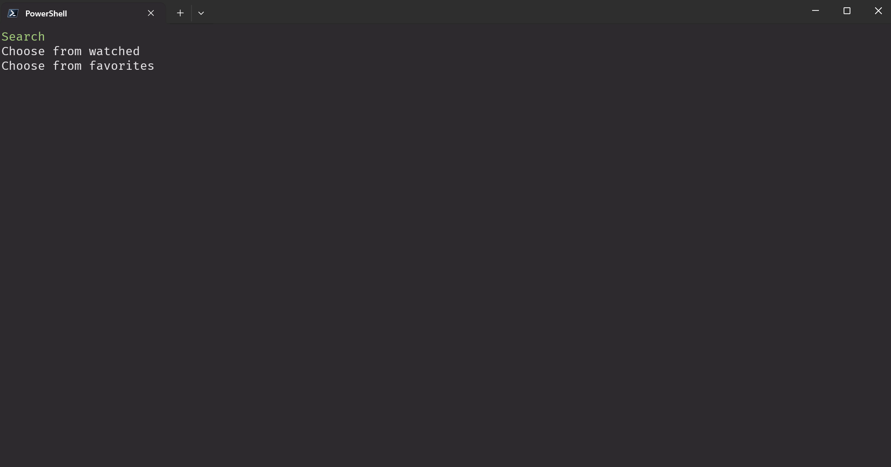
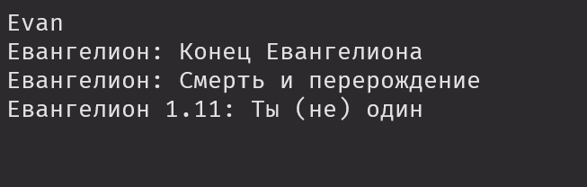
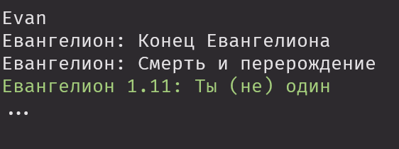
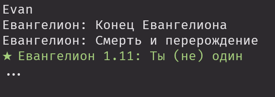
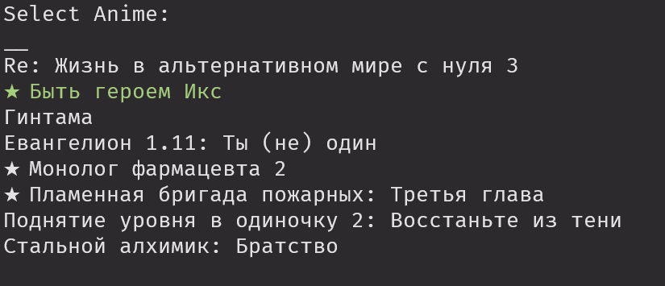

# Animego CLI
CLI (Консольное приложение) для просмотра аниме с сайта animego. Поддерживает поиск, сохранение истории просмотра, добавление в любимое и удаление из избранного (Favorite). Сохраняет прогресс просмотра серий. Не сохраняет прогресс просмотра отдельных серий. То есть если вы начали смотреть серию, но не досмотрели - приложение не сможет восстановить ваш просмотр внутри видео и будет считать что вы посмотрели эту серию полность. Приложение нацелено на удобство использования без мыши.

## Содержание
- [Технологии](#технологии)
- [Использование](#использование)
- [Разработка](#разработка)

## Технологии
- [HtmlAgilityPack](https://html-agility-pack.net/)
- [Powershell 7](https://learn.microsoft.com/ru-ru/powershell/scripting/install/installing-powershell-on-windows?view=powershell-7.5)
- [ffmpeg](https://www.gyan.dev/ffmpeg/)
- [video2x](https://github.com/k4yt3x/video2x)

## Использование
Проект представляет собой ряд ps1 скриптов работающих как единое консольное приложение.

Первое, что вам стоит сделать, запустить `setup.ps1` из Powershell 7:
```sh
$ setup.ps1
```

Затем перезапустить консоль. После этого вам будет доступна `Enter-Anime` команда.
```sh
$ Enter-Anime
```

Все движения в консоли выполняются либо стрелочками, либо клавишами: j - сточку вниз, k - строчку вверх, h - предыдущая страница, l - следующая страница, Enter - выбрать опцию. В списках с названиями аниме вы можете использовать клавиши f - добавить в список любимого, r - удалить из списка любимого. В этих списках значком звезды перед названием будут определяться аниме, которые находятся в списке любимых.

Стоит отметить, что список любимого лучше всего подходит по значению к списку текущего просмотра. Сужу по себе.

### Главный интерфейс Search, Choose from watched, Choose from favorites



После запуска тулы вас встречает список из трёх опций. Самая верхняя, Search, при выборе отобразит пустой экран консоли. В этот момент вы можете начать вводить название аниме на русском или анлийском. После ввода трёх символов каждый следующий символ будет провоцировать запрос к сайту и отображение полученых названий аниме из каталога. Если какое то аниме у вас не получается найти - скорее всего на сайте его нету. Например это так для аниме 'Сто девушек, которые очень-очень-очень-очень-очень сильно тебя любят'. В момент, когда вы увидите название нужного аниме, кликните Enter, это позволит вам перейти в режим выбора. Если вы передумали и хотите вернуться к вводу - выберите '***...***'. Если же вы уже не хотите искать аниме, но хотите выбрать из просмотренного или любимого - нажмите ***`*** (в простонародье это 'ё').




После выбора аниме перед вами появится либо список эпизодов с сайта, либо сразу выбор озвучки, если это фильм.

После выбора эпизода, озвучки и плеера:

1. Если у вас нету VLC пплеера в ***C:\Program Files\VideoLAN\VLC\vlc.exe*** то будет происходить его скачивание
2. Аниме будет записано в историю просмотра. И история просмотра и любимые аниме - это json файлы в папке ***temp/***, ***global.json*** и ***favorites.json*** соответственно. При этом только ***global.json*** содержит прогресс серий, если вам захочется как-то синхронизировать эту тулу на двух компьютерах - только эти два файла вам нужны.

### Choose from favorites

TL;DR - ***f*** добавить аниме, ***r*** удалить аниме

Для добавления аниме в этот список есть 2 способа:

1. В режиме Search после ввода названия и перехода в режим выбора (появляется '...') нажмите ***f*** (она же ***а*** в русской раскладке). После этого должна появиться звёздочка перед именем, что ознаминует успешное добавление. Если вы нажали ***f*** случайно, нажмите ***r*** для удаления из списка любимых аниме.
<br>


2. В режиме Choose from watched работает абсолютно так же как в режиме Search и даже проще.
<br>


Сам список из пункта Choose from favorites так же поддерживает добавление и удаление на те же клавиши, но он не реагирует на изменения. То есть после нажатия ***r*** хотя аниме и было удалено из списка, вы об этом не узнаете пока не выйдите и не зайдёте обратно. Это сделано для того, чтобы случайные нажатия могли быть отменены. Просто после случайного нажатия на ***r*** нажмите ***f*** на том же аниме и оно передобавится в список.

### Главный интерфейс Choose from downloaded

Проверяет парку ***/temp/animes*** на наличие скачаных серий сериалов. Добавление скачаных серий описано ниже. Удаление делайте вручную. Мне не хочется добавлять опцию которая может одной кнопкой снести файлы. Может потом добавлю с подтверждением.

- Во время выбора аниме или серии из скачаных вы также можете нажать ***f*** для того, чтобы запустить апскейлинг видео в 2 раза. В случае с нажатием при выборе сериала - будут одна за одной апскейлиться каждая серия. Для одной обычной 24 минутной серии это займёт около часа с лишним. Хз надо ли вам оно, но некоторое 720p от плеера кодик так плохи, что я решил добавить эту опцию.

### Скачивание аниме

Для скачивания серии в выбранной озвучке вам понадобится дойти до шага выбора плеера. Нажмите ***f*** для начала скачивания. Когда скачивание закончится будет сделан бип консолью.

## Разработка

### Требования
Для установки и запуска проекта, необходим [Powershell 7](https://learn.microsoft.com/ru-ru/powershell/scripting/install/installing-powershell-on-windows?view=powershell-7.5).

Права локаьного администратора понадобятся в случае если не установлен VLC плеер или если он не находится по стандартному пути установки.

## Источники
С парсером Kodik плеера помог код python библиотеки anime_parsers_ru